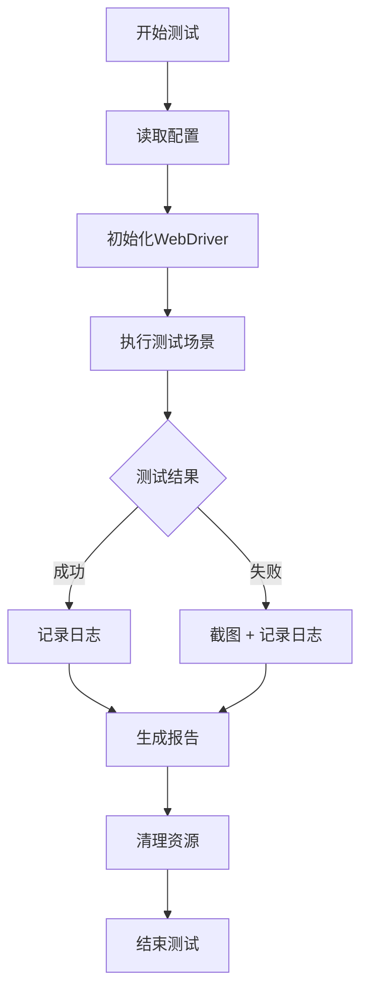

# 项目概览

## 🎯 项目目标

本项目是一个企业级Web自动化测试框架，旨在提供：
- 可维护性强的测试代码结构
- 高效的测试执行和报告
- 灵活的配置管理
- 完善的日志记录

## 🏗️ 架构设计

### 分层架构

```
┌─────────────────────────────────────┐
│           测试层 (Tests)             │
│     *.feature + *Steps.java        │
├─────────────────────────────────────┤
│          页面层 (Pages)              │
│        *Page.java classes          │
├─────────────────────────────────────┤
│          核心层 (Core)               │
│   DriverFactory + ConfigReader     │
├─────────────────────────────────────┤
│         工具层 (Utils)               │
│      LoggerUtil + BasePage         │
└─────────────────────────────────────┘
```

### 设计模式

1. **页面对象模式 (Page Object Pattern)**
   - 封装页面元素和操作
   - 提高代码复用性
   - 降低维护成本

2. **工厂模式 (Factory Pattern)**
   - DriverFactory 管理WebDriver实例
   - 支持多浏览器切换

3. **单例模式 (Singleton Pattern)**
   - ConfigReader 配置管理
   - 确保配置一致性

## 🔄 测试流程

### 测试执行流程



### 生命周期管理

- **@BeforeSuite**: 测试套件初始化
- **@BeforeScenario**: 场景前置操作
- **@AfterScenario**: 场景后置操作（截图、日志）
- **@AfterSuite**: 资源清理

## 📊 测试报告

### 报告类型

1. **Allure报告**
   - 美观的HTML报告
   - 详细的测试步骤
   - 截图和日志附件

2. **TestNG报告**
   - 传统的测试报告
   - 测试结果统计

3. **Cucumber报告**
   - BDD风格报告
   - 场景执行详情

### 报告生成命令

```bash
# 生成所有报告
mvn clean test allure:report

# 启动Allure服务器
mvn allure:serve
```

## 🔧 扩展指南

### 添加新页面

1. 创建页面类继承 `BasePage`
2. 定义页面元素定位器
3. 实现页面操作方法
4. 添加日志记录

```java
public class NewPage extends BasePage {
    private static final Logger logger = LoggerUtil.getLogger(NewPage.class);
    private final By element = By.id("element-id");
    
    public NewPage(WebDriver driver) {
        super(driver);
    }
    
    public void performAction() {
        LoggerUtil.logElementAction(logger, "Performing action", element.toString());
        click(element);
    }
}
```

### 添加新测试场景

1. 在 `.feature` 文件中定义场景
2. 创建对应的步骤定义
3. 实现测试逻辑
4. 添加断言验证

### 配置新环境

1. 修改 `config.properties`
2. 添加环境特定配置
3. 更新测试数据

## 🚀 性能优化

### 执行速度优化

1. **并行执行**
   ```xml
   <parallel>methods</parallel>
   <thread-count>3</thread-count>
   ```

2. **智能等待**
   - 使用显式等待替代Thread.sleep
   - 合理设置超时时间

3. **资源管理**
   - 及时关闭WebDriver
   - 清理临时文件

### 稳定性提升

1. **重试机制**
   ```java
   @Retryable(value = {Exception.class}, maxAttempts = 3)
   ```

2. **异常处理**
   - 捕获并记录异常
   - 提供有意义的错误信息

3. **元素定位优化**
   - 使用稳定的定位策略
   - 避免依赖动态属性

## 📈 最佳实践

### 代码规范

1. **命名规范**
   - 类名：PascalCase
   - 方法名：camelCase
   - 常量：UPPER_SNAKE_CASE

2. **注释规范**
   - 类和方法添加JavaDoc
   - 复杂逻辑添加行内注释

3. **异常处理**
   - 使用具体的异常类型
   - 提供清晰的错误信息

### 测试设计

1. **独立性**
   - 测试之间不应有依赖
   - 每个测试都能独立运行

2. **可读性**
   - 使用描述性的测试名称
   - BDD风格的场景描述

3. **可维护性**
   - 避免硬编码
   - 使用配置文件管理数据

## 🔍 监控和调试

### 日志分析

- **INFO级别**: 测试步骤和关键操作
- **DEBUG级别**: 详细的元素交互
- **WARN级别**: 潜在问题警告
- **ERROR级别**: 错误和异常

### 调试技巧

1. **元素高亮**: 启用元素高亮功能
2. **截图分析**: 查看失败时的页面状态
3. **日志追踪**: 分析详细的执行日志
4. **断点调试**: 使用IDE调试功能

## 📚 学习资源

- [Selenium官方文档](https://selenium-python.readthedocs.io/)
- [Cucumber官方文档](https://cucumber.io/docs/)
- [TestNG官方文档](https://testng.org/doc/)
- [Allure报告文档](https://docs.qameta.io/allure/)

---

**持续改进，追求卓越！** 🌟